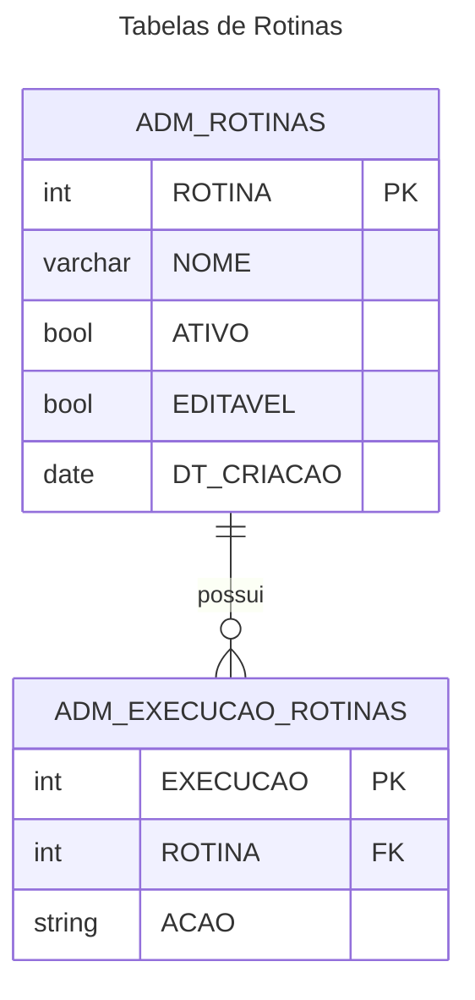

DER Tabelas do robo

id: 83e757a6016d4b6095e59e6741e6b256
parent_id: cf69a7f3e59e46228920a5cddc6b4306
created_time: 2024-08-09T13:41:09.332Z
updated_time: 2024-08-11T10:37:08.633Z
is_conflict: 0
latitude: -23.18570760
longitude: -46.89780570
altitude: 0.0000
author: 
source_url: 
is_todo: 0
todo_due: 0
todo_completed: 0
source: joplin-desktop
source_application: net.cozic.joplin-desktop
application_data: 
order: 0
user_created_time: 2024-08-09T13:41:09.332Z
user_updated_time: 2024-08-11T10:37:08.633Z
encryption_cipher_text: 
encryption_applied: 0
markup_language: 1
is_shared: 0
share_id: 
conflict_original_id: 
master_key_id: 
user_data: 
deleted_time: 0
type_: 1