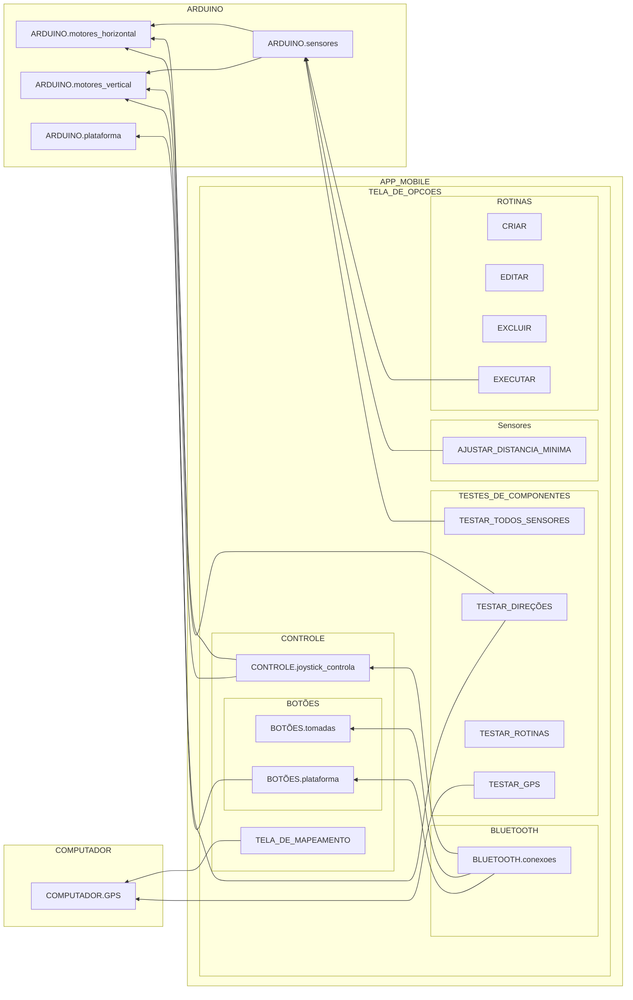

SISTEMAS

# CONTROLE BLUETOOTH

id: 9c76131773d447a19268261ce6c63373
parent_id: cf69a7f3e59e46228920a5cddc6b4306
created_time: 2024-04-19T12:39:45.348Z
updated_time: 2024-06-11T13:27:56.498Z
is_conflict: 0
latitude: -23.22370100
longitude: -45.90090740
altitude: 0.0000
author: 
source_url: 
is_todo: 0
todo_due: 0
todo_completed: 0
source: joplin-desktop
source_application: net.cozic.joplin-desktop
application_data: 
order: 0
user_created_time: 2024-04-19T12:39:45.348Z
user_updated_time: 2024-06-11T13:27:56.498Z
encryption_cipher_text: 
encryption_applied: 0
markup_language: 1
is_shared: 0
share_id: 
conflict_original_id: 
master_key_id: 
user_data: 
deleted_time: 0
type_: 1